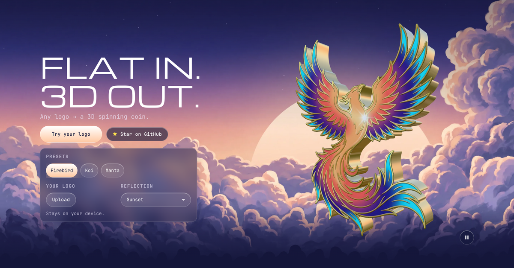

<div align="center">

```
                 ██████╗ ██████╗     ██╗      ██████╗  ██████╗  ██████╗
                 ╚════██╗██╔══██╗    ██║     ██╔═══██╗██╔════╝ ██╔═══██╗
                  █████╔╝██║  ██║    ██║     ██║   ██║██║  ███╗██║   ██║
                  ╚═══██╗██║  ██║    ██║     ██║   ██║██║   ██║██║   ██║
                 ██████╔╝██████╔╝    ███████╗╚██████╔╝╚██████╔╝╚██████╔╝
                 ╚═════╝ ╚═════╝     ╚══════╝ ╚═════╝  ╚═════╝  ╚═════╝
```

### Flat in. 3D out.

Any logo → a 3D spinning coin, as one self-contained React Three Fiber component.

<br/>


<sub><b>FIREBIRD</b> &nbsp;·&nbsp; <b>KOI</b> &nbsp;·&nbsp; <b>MANTA</b></sub>

<br/><br/>

[](https://hasuwini77.github.io/3d-logo-skill/)&nbsp;
[](https://agentskills.io)&nbsp;
[](LICENSE)

<sub>Claude Code · Cursor · Codex · Gemini CLI · GitHub Copilot · <a href="https://agentskills.io/specification">50+ more</a></sub>

</div>

---

> The rim isn't a generic circle. It traces your logo's actual outline, every concave notch included.

## Install

```bash
npx skills add hasuwini77/3d-logo-skill
```

`npx skills add` detects which agents you have and drops the skill in the right folder for each.

<details>
<summary>Claude Code plugin install</summary>

```bash
# terminal
claude plugin marketplace add hasuwini77/3d-logo-skill
claude plugin install 3d-logo@3d-logo-skill

# or inside a Claude Code session
/plugin marketplace add hasuwini77/3d-logo-skill
/plugin install 3d-logo@3d-logo-skill
```

</details>

## Usage

Ask your agent:

```
Make my logo at public/logo.png into a 3D spinning coin
```
```
Use /3d-logo on src/assets/brand-logo.png with night reflections
```

You get a self-contained `SpinningLogo3D.tsx`. Drop it anywhere in your React app:

```tsx
import { SpinningLogo3D } from './SpinningLogo3D'

<SpinningLogo3D size={540} />
```

## Live demo

<a href="https://hasuwini77.github.io/3d-logo-skill/"></a>

**[hasuwini77.github.io/3d-logo-skill](https://hasuwini77.github.io/3d-logo-skill/)**: pick a preset or drop in your own logo, switch reflections, drag the thickness. It runs the same `SpinningLogo3D.tsx` architecture the skill generates. Your file is processed on an offscreen canvas and never leaves your device.

## How it works

1. **Background removal**: samples the 1px border, then flood-fills the connected background from the edge. Enclosed details (the white of an eye, the inside of an "O") stay put.
2. **Outline tracing**: Moore-neighbour contour trace per shape at a real opacity cutoff, with specks dropped. Multi-part logos keep every piece.
3. **Faces**: front and back planes cut to the same outline; the back is a true mirror, like a stamped coin.
4. **Chrome rim**: indexed `BufferGeometry` along the smoothed outline, with outward normals for clean reflections.
5. **Emboss + light**: Sobel normal map on the faces, environment reflections, and `NeutralToneMapping` so your colours don't wash out.

## Reflections

| Preset | Best for | Feeling |
|--------|----------|---------|
| **studio** | Corporate, SaaS | Clean, neutral (default) |
| **warehouse** | Gaming, industrial | Gritty, darker |
| **city** | Tech, startups | Urban, bright |
| **night** | Dark themes, premium | Moody, elegant |
| **dawn** | Health, wellness | Soft, warm |
| **sunset** | Creative, entertainment | Rich amber |

## Customization

| Constant | Default | Controls |
|----------|---------|----------|
| `PLANE_SIZE` | 4.8 | Logo face size (3D units) |
| `THICKNESS` | 0.45 | Coin edge thickness, also exposed as a `thickness` prop |
| `SPIN_SPEED` | 0.35 | Rotation speed (rad/s) |
| `BG_TOLERANCE` | 24 | How close a pixel must be to the border colour to count as background (0–255) |
| `EMBOSS_STRENGTH` | 1.5 | Normal map depth (0 = flat, 3+ = deep) |

## Requirements

```bash
npm install three @react-three/fiber @react-three/drei
npm install -D @types/three
```

## Contributing

1. Fork → feature branch → edit `.claude/skills/3d-logo/SKILL.md`
2. Test locally: `claude plugin marketplace add ./` then `claude plugin install 3d-logo@3d-logo-skill`
3. Open a PR with before/after coins

Open ideas: inner rim for logos with holes, hover interactions, glow, custom shaders.

## License

MIT. Do whatever you want with it.

---

<div align="center">
<sub>Built with <a href="https://github.com/pmndrs/react-three-fiber">React Three Fiber</a> + <a href="https://github.com/pmndrs/drei">drei</a> + <a href="https://threejs.org">Three.js</a></sub>
<br/><br/>
<b>If this saved you time, drop a ⭐</b>
</div>
